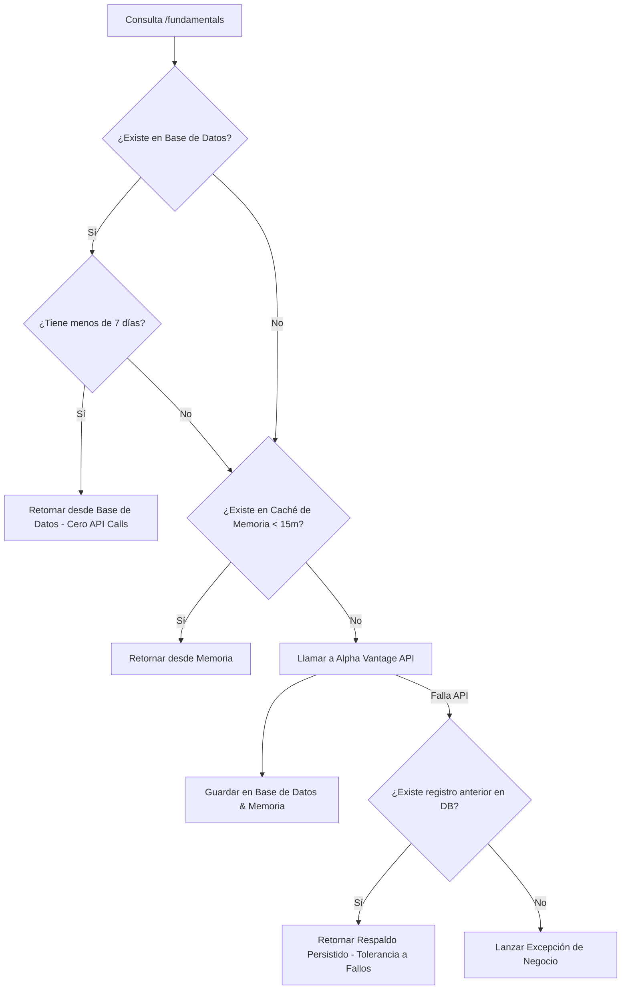

# ☕ Broker Backend API

API robusta construida con **Spring Boot 3.3.5** y **Java 21**, encargada de la lógica de negocio, persistencia en base de datos MySQL, procesamiento de transacciones financieras, seguridad multiusuario con Google Authentication/JWT y sincronización inteligente de mercado.

> [!NOTE]
> Documentación del backend actualizada a **Mayo de 2026**, incorporando las últimas características técnicas implementadas en la plataforma.

---

## 🏗️ Stack Tecnológico
* **Lenguaje**: Java 21 (LTS)
* **Framework**: Spring Boot 3.3.5
* **Seguridad**: Spring Security 6 + JJWT (JSON Web Token)
* **Persistencia**: Spring Data JPA + Hibernate + MySQL
* **Planificación**: Spring Task Scheduling (`@Scheduled`)
* **Cliente REST**: Spring `RestClient` (nativo en Spring 6) para consumo asíncrono de APIs externas
* **Validación**: `spring-boot-starter-validation` (JSR-380)

---

## 📂 Estructura del Código

La estructura de paquetes sigue un diseño limpio por capas:

```text
Backend/
|-- pom.xml
|-- README.md
`-- src/
    `-- main/
        |-- java/com/broker/backend/
        |   |-- config/          # Seguridad (CORS, JWT, SecurityConfig) y beans globales
        |   |-- controller/      # API REST Controllers expuestos al frontend
        |   |-- exception/       # Manejo centralizado de excepciones y respuestas estandarizadas
        |   |-- model/           # DTOs (Request / Response Records) para transferir datos
        |   |   |-- market/
        |   |   |-- movimiento/
        |   |   `-- portafolio/
        |   |-- persistence/     # Acceso a datos
        |   |   |-- entity/      # Entidades JPA (Mapeo relacional de base de datos)
        |   |   `-- repository/  # Repositorios Spring Data JPA
        |   `-- service/         # Lógica de negocio core (Servicios transaccionales)
        `-- resources/
            |-- application.properties    # Variables y configuraciones de Spring
            |-- schema.sql                # Inicialización DDL de MySQL
            |-- data.sql                  # Inicialización DML de catálogos
            |-- seed_movimientos_demo.sql # Datos demo para movimientos personales
            `-- seed_portafolio_demo.sql  # Datos demo para el portafolio broker
```

---

## ⚙️ Características Técnicas Clave e Implementaciones

### 🔐 1. Seguridad e Identidad Multiusuario
El backend está diseñado desde cero como un ecosistema multiusuario aislado y seguro:
* **Filtro JWT Personalizado**: [JwtAuthFilter](file:///c:/Users/Alejandro/Documents/Broker/Backend/src/main/java/com/broker/backend/config/JwtAuthFilter.java) intercepta cada petición HTTP, valida el encabezado `Authorization: Bearer <token>`, extrae los claims del usuario y establece el contexto de seguridad.
* **Google OAuth Verification**: El endpoint `/api/auth/google` valida los tokens de identidad recibidos desde el cliente NextAuth directamente contra el proveedor de Google de manera segura.
* **Aprovisionamiento Automático (Transaccional)**: Al autenticarse un nuevo usuario por primera vez, el backend crea de forma atómica su perfil de persona (`tbl_persona`), su cuenta de gestor financiero (`tbl_cuenta_gestor`) y su cuenta broker demo (`tbl_cuenta_broker`) con un saldo base de **30,000,000 COP**.
* **Seguridad Declarativa**: Mediante `@AuthenticationPrincipal String userEmail`, los controladores aíslan las consultas en base de datos garantizando que un usuario jamás acceda a los registros de otro.

### 🛡️ 2. Estrategia de Doble Caché para Alpha Vantage (Market Data)
El backend implementa un doble mecanismo de optimización para proteger la cuota de la API externa de Alpha Vantage:



* **Caché en Base de Datos (`tbl_analisis_fundamental_accion`)**: Cuando el cliente solicita el análisis fundamental de un activo, el servicio [FundamentalAnalysisService.java](file:///c:/Users/Alejandro/Documents/Broker/Backend/src/main/java/com/broker/backend/service/FundamentalAnalysisService.java) valida si existe en base de datos y si su fecha de actualización es menor o igual a **7 días** (`CACHE_DAYS = 7`). Si se cumple, lo sirve directamente desde MySQL.
* **Caché en Memoria (In-Memory Maps)**: Para mitigar múltiples consultas concurrentes del mismo símbolo en ráfagas de renders, el backend guarda las respuestas en memoria en mapas concurrentes (`ConcurrentHashMap`) con un tiempo de expiración (TTL) configurable mediante `MARKET_CACHE_TTL_MINUTES`, por defecto **1 minuto**.
* **Respaldo Local Fijo**: En ausencia de conexión con Alpha Vantage, el sistema expone un sembrado local predefinido en base a Apple, NVIDIA, Tesla, Amazon, Microsoft y Meta. El endpoint `/api/market/status` reporta en tiempo real si el servidor está consumiendo datos en vivo (`alpha_vantage`) o si está operando bajo el `respaldo_local`.

### 📈 3. Motor Transaccional de Trading (Órdenes Market, Limit y Stop)
El servicio [TradingService.java](file:///c:/Users/Alejandro/Documents/Broker/Backend/src/main/java/com/broker/backend/service/TradingService.java) administra toda la lógica transaccional de simulación bursátil:
* **Órdenes de Mercado**: Se ejecutan inmediatamente si el mercado está abierto usando el precio cotizado actual.
* **Órdenes Límite**: Quedan en estado `pendiente`. Se ejecutan únicamente si el precio de mercado cumple la condición (`compra`: precio actual <= precio límite; `venta`: precio actual >= precio límite).
* **Órdenes Stop**: Quedan en estado `pendiente`. Actúan bajo un disparador de tendencia (`compra`: precio actual >= precio stop; `venta`: precio actual <= precio stop).
* **Aislamiento Financiero y Bloqueo de Fondos**:
  * Al ingresar una orden de compra pendiente, el valor total estimado de la transacción se mueve temporalmente de `saldo_disponible` a `saldo_congelado` en `tbl_cuenta_broker`, evitando que el usuario gaste esos fondos en otras operaciones.
  * Al ingresar una orden de venta pendiente, se verifica que la cantidad propuesta a vender no supere las unidades de la posición actual restando otras órdenes de venta que ya se encuentren pendientes (`sumPendingSellQuantityExcludingOrder`).
* **Actualización en Caliente (Edición y Cancelación)**: El backend permite actualizar la cantidad o precio límite de una orden con estado `pendiente`, recalculando e incrementando/liberando el saldo congelado correspondiente en caliente. Al cancelar una orden pendiente, los fondos congelados vuelven de inmediato al saldo disponible.
* **Reinicio de Simulación**: `/api/portafolio/reset` borra en cascada todas las órdenes y posiciones abiertas vinculadas al usuario, restableciendo el saldo disponible a **30,000,000 COP** y el congelado a **0.00 COP**.

### ⏱️ 4. Scheduler de Ejecución Continua de Órdenes
* Un job en segundo plano (`processPendingOrdersOnSchedule`) se ejecuta automáticamente cada minuto (`60000ms`).
* **Validación de Horario**: Antes de evaluar, el servicio verifica si el mercado bursátil de Nueva York está abierto (Lunes a Viernes de 9:30 AM a 4:00 PM EST).
* **Flujo del Scheduler**:
  1. Consulta todas las órdenes con estado `pendiente` ordenadas por fecha y ID.
  2. Obtiene la cotización fresca del activo a través de `MarketService`.
  3. Evalúa si se cumple el precio de activación (Límite o Stop).
  4. Ejecuta de forma segura: actualiza saldo, genera el precio promedio ponderado en `tbl_posicion` y actualiza el estado a `ejecutada`.
  5. En caso de fallar por factores externos (por ejemplo, que el saldo disponible no cubra el spread de variación del mercado al ejecutarse una compra), rechaza de forma transparente la orden (`rechazada`) y devuelve el saldo congelado correspondiente al balance disponible.

---

## 🔗 Endpoints Expuestos de la API

Todos los endpoints (excepto la validación inicial de login) requieren el encabezado `Authorization: Bearer <JWT>`.

### 🔑 Autenticación
* `POST /api/auth/google` - Intercambia el Google ID Token por el JWT propietario del backend.

### 💰 Movimientos Finanzas Personales
* `GET /api/movimientos` - Retorna los ingresos y egresos del usuario autenticado.
* `POST /api/movimientos` - Registra un nuevo ingreso o egreso, actualizando el saldo de la cuenta gestora.
* `PUT /api/movimientos/{id}` - Modifica un movimiento previo y ajusta el balance.
* `DELETE /api/movimientos/{id}` - Remueve un movimiento y recalcula el saldo.

### 📊 Portafolio Simulado
* `GET /api/portafolio/summary` - Obtiene los saldos de la cuenta broker (`saldoDisponible` y `saldoCongelado`).
* `GET /api/portafolio/positions` - Lista los activos en cartera del usuario autenticado junto con su precio promedio y cotización actual.
* `GET /api/portafolio/orders` - Retorna el historial de órdenes (ejecutadas, pendientes, canceladas, rechazadas) del usuario.
* `POST /api/portafolio/orders` - Registra una nueva orden (Market, Limit, Stop).
* `PUT /api/portafolio/orders/{orderId}` - Edita cantidad o precio de una orden pendiente.
* `DELETE /api/portafolio/orders/{orderId}` - Cancela una orden pendiente y libera fondos si corresponde.
* `POST /api/portafolio/reset` - Reinicia la cuenta demo restableciendo el balance base y borrando registros.

### 📈 Mercado y Cotizaciones
* `GET /api/market/most-active` - Devuelve las cotizaciones más activas (con caché integrado configurable mediante `MARKET_CACHE_TTL_MINUTES`, por defecto 1 minuto).
* `GET /api/market/assets/{symbol}` - Devuelve la cotización y variación de un activo.
* `GET /api/market/assets/{symbol}/fundamentals` - Retorna métricas fundamentales del activo consultando DB o Alpha Vantage.
* `GET /api/market/status` - Retorna metadatos de sincronización, la fuente de mercado utilizada y el estado de la API Key.

---

## 🗂️ Mapeo Físico de Base de Datos (JPA Entities)

El backend expone 17 tablas normalizadas en el esquema MySQL:
* **tbl_analisis_fundamental_accion** (`AnalisisFundamentalAccionEntity`): Tabla nueva para el almacenamiento estructurado de métricas. Cuenta con una clave única por símbolo (`simbolo`) y una relación opcional hacia `tbl_activo`.
* **tbl_cuenta_broker** (`CuentaBrokerEntity`): Almacena saldos (`saldo_disponible`, `saldo_congelado`) y metadatos de reinicio demo.
* **tbl_posicion** (`PosicionEntity`): Vincula cuenta y activo para determinar el promedio ponderado de compra.
* **tbl_orden** (`OrdenEntity`): Controla estados (`tbl_estado_orden`) y tipos de ejecución (`tbl_tipo_orden`).

---

## ⚙️ Variables de Entorno y Configuración Local

### Archivo `application.properties`
```properties
server.port=8080

# Orígenes Permitidos para CORS
app.cors.allowed-origin-patterns=http://localhost:3000

# Base de Datos
spring.datasource.url=${DB_URL:jdbc:mysql://localhost:3306/broker_db?useSSL=false&serverTimezone=America/Bogota&allowPublicKeyRetrieval=true}
spring.datasource.username=${DB_USERNAME:root}
spring.datasource.password=${DB_PASSWORD:root}

# Hibernate DDL
spring.jpa.hibernate.ddl-auto=none
spring.sql.init.mode=never

# Seguridad
jwt.secret=${JWT_SECRET:un_secreto_super_seguro_firmado_con_256_bits_minimo}
google.client.ids=${GOOGLE_CLIENT_IDS:prod_client_id,local_client_id}

# APIs Externas
alpha.vantage.api-key=${ALPHA_VANTAGE_API_KEY:}

# Demora de Job Programado (Opcional, por defecto 60 segundos)
broker.orders.pending-processor-delay-ms=60000
```

---

## 🚀 Ejecución en Desarrollo

### Requisitos previos
* **Java SDK 21** configurado.
* **Maven 3.9+** instalado.
* Instancia local de **MySQL** en puerto `3306`.

### Pasos
1. Ejecute secuencialmente los scripts ubicados en `src/main/resources/` (`schema.sql` -> `data.sql` -> seeds).
2. Proporcione las variables necesarias en su entorno o configure el valor de desarrollo en `application.properties`.
3. Inicie el backend ejecutando desde la raíz de `Backend/`:
```bash
mvn spring-boot:run
```
El servidor levantará satisfactoriamente en `http://localhost:8080`.
