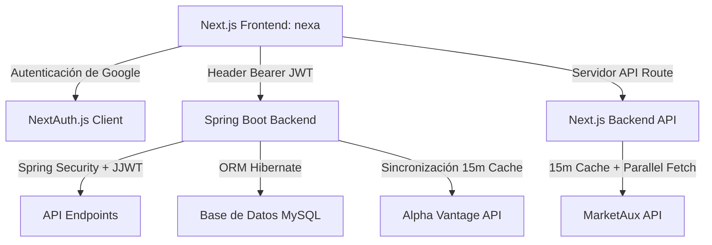

# 📈 Broker Ecosistema Financiero

Ecosistema financiero interactivo multiusuario con simulación de inversiones, gestión de finanzas personales, análisis fundamental de activos y noticias del mercado global en tiempo real.

> [!NOTE]
> Documentación del estado del proyecto a **Mayo de 2026**, recopilando e integrando las últimas actualizaciones de la plataforma (Stop/Limit Orders, Caching de APIs externas, Análisis Fundamental de activos, optimización de noticias en paralelo, reinicio de cuenta demo y planificador automático).

---

## 🗺️ Arquitectura de la Plataforma

El ecosistema se divide en dos componentes independientes que se comunican mediante HTTP REST y están acoplados bajo una única fuente de verdad:



### 💻 Frontend (`nexa/`)
* **Framework**: Next.js 16.2.1 (Pages Router)
* **UI/UX**: React 19, Vanilla CSS 3 + Tailwind CSS 4 para controles fluidos, gráficos y animaciones interactivas.
* **Sesiones y Seguridad**: NextAuth.js 4.24 con persistencia del JWT propietario del backend.
* **Componentes**: Gráficos con Chart.js y `react-chartjs-2`, iconos dinámicos con `@iconify/react` y carruseles premium de mercado.
* **Ruta local**: [http://localhost:3000](http://localhost:3000)

### ☕ Backend (`Backend/`)
* **Framework**: Spring Boot 3.3.5
* **Runtime**: Java 21
* **Seguridad**: Spring Security 6 + Filtros JWT (`JwtAuthFilter`) para aislamiento estricto de datos por usuario (correo electrónico).
* **Persistencia**: Spring Data JPA + MySQL (Driver Connector/J).
* **Servicios Programados**: Scheduler activo para ejecución continua de órdenes pendientes.
* **Ruta local**: [http://localhost:8080](http://localhost:8080)

---

## ⚡ Novedades y Características Clave (Mayo 2026)

### 1. 🛡️ Sistema de Caché Multicapa para APIs Externas
Para evitar el consumo excesivo de créditos de las APIs de Alpha Vantage y robustecer la aplicación ante caídas del proveedor, se implementó una estrategia híbrida:
* **Caché en Base de Datos (Persistente)**: Las consultas del endpoint `GET /api/market/assets/{symbol}/fundamentals` almacenan los datos en la tabla `tbl_analisis_fundamental_accion`. Si un registro existe y se actualizó hace **menos de 7 días**, se retorna de inmediato sin consumir API externa.
* **Caché en Memoria (Sesión/Transición)**:
  * El backend almacena cotizaciones individuales (`GLOBAL_QUOTE`) e índices más activos (`TOP_GAINERS_LOSERS`) con un tiempo de vida (TTL) configurable mediante `MARKET_CACHE_TTL_MINUTES`, por defecto **1 minuto**.
  * Las peticiones consecutivas al análisis fundamental de activos usan un caché de mapa de memoria con **15 minutos** de TTL en el servicio [FundamentalAnalysisService.java](file:///c:/Users/Alejandro/Documents/Broker/Backend/src/main/java/com/broker/backend/service/FundamentalAnalysisService.java).
* **Respaldo Local (Seeding)**: En caso de ausencia total de API Keys o caída de conexión, la aplicación sembrará un universo de datos fijos (`AAPL`, `NVDA`, `TSLA`, `AMZN`, `MSFT`, `META`) asegurando que el simulador continúe 100% operativo.

### 📊 2. Análisis Fundamental en Tiempo Real
* Se integró el modal [ModalAnalisisFundamental](file:///c:/Users/Alejandro/Documents/Broker/nexa/src/pages/invertir/index.tsx) en el panel de **Invertir** para proporcionar a los usuarios métricas empresariales avanzadas directamente desde la base de datos o Alpha Vantage:
  * **Valoración**: Ratio PER (P/E), Forward PER, PEG Ratio, Price-to-Sales (TTM), Price-to-Book.
  * **Eficiencia**: Margen Operativo, Margen de Utilidad, Retorno de Activos (ROA TTM) y Retorno de Capital (ROE TTM).
  * **Dividendos**: Pago por acción, Rentabilidad por Dividendo (Dividend Yield), fechas de ex-dividendos.
  * **Métricas**: EBITDA, EPS (Ganancia por Acción), Valor Libro, Precio Objetivo de Analistas, Máximos y Mínimos de 52 semanas y Medias Móviles (50 y 200 días).
* Los datos se cargan de manera asíncrona únicamente al abrir el modal para optimizar el rendimiento del frontend.

### 💸 3. CRUD Completo de Órdenes (Stop, Limit y Market)
* **Tipos de Órdenes Soportados**:
  * `mercado`: Ejecutada de inmediato si el mercado está abierto usando el precio actual.
  * `limite`: Compra cuando el precio cae por debajo del valor indicado; vende cuando sube por encima de él.
  * `stop`: Compra cuando el precio cruza al alza la barrera indicada (Trigger); vende cuando cae por debajo del límite de Stop.
* **Aislamiento Financiero**:
  * Al crear una orden de compra pendiente, el dinero requerido se resta de `saldoDisponible` y se almacena en `saldoCongelado`, impidiendo compras dobles.
  * Al crear una orden de venta pendiente, se realiza una comprobación para asegurar que la cantidad a vender no supera la cantidad libre de la posición actual (restando otras ventas pendientes ya activas mediante `sumPendingSellQuantity`).
* **Edición y Cancelación**: Los usuarios pueden modificar (precio/cantidad) o cancelar órdenes con estado `pendiente` directamente desde la pestaña de órdenes. Al cancelar una compra pendiente, el saldo congelado se descongela e integra de inmediato al disponible.
* **Reinicio de Cuenta Demo**: Se habilitó el botón **Reiniciar demo** en la pantalla de portafolio para restaurar el saldo inicial ficticio (30,000,000 COP), vaciar el historial de órdenes y remover posiciones abiertas tras una confirmación del usuario.

### ⏱️ 4. Procesamiento Automático con Scheduler
* El backend cuenta con un job programado que corre en segundo plano cada minuto ([TradingService.java](file:///c:/Users/Alejandro/Documents/Broker/Backend/src/main/java/com/broker/backend/service/TradingService.java)).
* Si el mercado financiero está abierto (lunes a viernes, 9:30 AM a 4:00 PM hora de Nueva York), el scheduler evalúa todas las órdenes con estado `pendiente`.
* Si se cumplen las condiciones límite/stop, las ejecuta de forma transparente: realiza transacciones de saldos, genera promedios ponderados y actualiza posiciones en la base de datos.
* Si una orden de compra ya no cuenta con saldo disponible suficiente en la cuenta en el momento de procesarse, el scheduler la marca como `rechazada` y libera de inmediato los fondos congelados correspondientes.

### 📰 5. Optimización del Feed de Noticias
* **Paginación en Paralelo**: Dado que la suscripción gratuita de la API de MarketAux limita a 3 artículos por petición, la API route de Next.js ([noticias.ts](file:///c:/Users/Alejandro/Documents/Broker/nexa/src/pages/api/news/noticias.ts)) ahora realiza **6 peticiones concurrentes en paralelo** (páginas 1 a 6) para consolidar hasta 18 artículos simultáneos.
* **Filtrado y Robustez**: Remoción automática de artículos duplicados (basado en UUID/URL) y clasificación inteligente en categorías (`Acciones`, `Cripto`, `Mundiales`).
* **Caché en Servidor**: Las noticias se guardan en un caché temporal del servidor Next.js durante **15 minutos**. En caso de agotarse las llamadas o fallar la API principal, el sistema devuelve automáticamente el feed cached sin afectar la experiencia del usuario.

---

## 🗂️ Módulos de la Aplicación y Estado de Implementación

### 1. Portafolio (`/portafolio`)
* **Estado**: 🟢 **100% Funcional**
* **Frontend**: Muestra indicadores clave de la cuenta (Saldo Disponible, Valor Total de Activos, Rendimiento Porcentual Acumulado y Variación Diaria Promedio). Contiene dos pestañas principales (Acciones en cartera y Órdenes registradas) con capacidad de gestionar de inmediato órdenes pendientes.
* **Backend**: Controlado en [PortfolioController.java](file:///c:/Users/Alejandro/Documents/Broker/Backend/src/main/java/com/broker/backend/controller/PortfolioController.java). Consume datos aislados de `tbl_posicion`, `tbl_orden` y realiza cálculos de rentabilidad histórica usando datos ponderados de transacciones previas.

### 2. Invertir (`/invertir`)
* **Estado**: 🟢 **100% Funcional**
* **Frontend**: Lista las cotizaciones más dinámicas, incluye un carrusel de acciones destacadas, un buscador por texto, gráficas de comportamiento frente al portafolio y la tarjeta avanzada de operaciones (Compra/Venta, Órdenes de Mercado/Límite/Stop).
* **Backend**: Mapeado en [MarketController.java](file:///c:/Users/Alejandro/Documents/Broker/Backend/src/main/java/com/broker/backend/controller/MarketController.java). Expone cotizaciones, detalles individuales, metadatos del estado del mercado y análisis fundamental.

### 3. Control de Dinero (`/controlador`)
* **Estado**: 🟢 **100% Funcional**
* **Frontend**: Administrador de ingresos/egresos personales con listado de movimientos, creación, edición, eliminación y gráfica acumulativa del comportamiento financiero del mes.
* **Backend**: Expone operaciones CRUD completas aisladas por el token del usuario sobre `tbl_movimiento` y `tbl_cuenta_gestor`.

### 4. Noticias Real-Time (`/noticias`)
* **Estado**: 🟢 **100% Funcional**
* **Frontend**: Tarjetas optimizadas por filtros (`Todas`, `Acciones`, `Cripto`, `Mundiales`), con imagen de portada, enlace a fuente oficial, fecha de publicación y estados pulidos de carga.

---

## 🔐 Seguridad e Identidad (Google OAuth + JWT)

El ecosistema cuenta con protección total multiusuario estructurada en las siguientes etapas:
1. **Inicio de sesión**: El cliente se autentica en la UI mediante el portal de Google Auth implementado a través de `NextAuth.js`.
2. **Validación en Backend**: Al recibir el token de sesión (`id_token`), el frontend lo transmite al backend en `POST /api/auth/google`. El backend utiliza la biblioteca oficial `google-api-client` para validar la autenticidad del token directamente con los servidores de Google.
3. **Aprovisionamiento Automático**: Si es la primera vez que el usuario ingresa, el backend crea en una transacción atómica el registro en `tbl_persona`, su cuenta broker con balance inicial demo (`tbl_cuenta_broker`) y su cuenta gestora personal (`tbl_cuenta_gestor`).
4. **JWT Propietario**: Tras validar la firma del token de Google, el backend genera un token **JJWT firmado** con validez de sesión y lo entrega al cliente.
5. **Aislamiento en Consultas**: El cliente guarda este token y lo adjunta en el encabezado `Authorization: Bearer <token>` para todas sus peticiones. El backend valida el token e inyecta el correo del usuario en el contexto de seguridad (`@AuthenticationPrincipal`), aislando de forma absoluta las operaciones en la base de datos.

---

## 🛢️ Esquema de la Base de Datos

El diseño físico en MySQL consta de 17 tablas normalizadas configuradas en [schema.sql](file:///c:/Users/Alejandro/Documents/Broker/Backend/src/main/resources/schema.sql):

| Tabla | Descripción |
|---|---|
| `tbl_tipo_documento` | Tipos de identificación soportados |
| `tbl_estado_cuenta` | Estados posibles de cuentas broker/gestor |
| `tbl_estado_activo` | Control de activos listados (`activo`, `suspendido`) |
| `tbl_estado_orden` | Estados de órdenes (`ejecutada`, `pendiente`, `rechazada`, `cancelada`) |
| `tbl_tipo_movimiento` | Tipos en finanzas personales (`ingreso`, `egreso`) |
| `tbl_tipo_activo` | Tipos de mercado (`accion`, `cripto`, `etf`) |
| `tbl_tipo_orden` | Tipos de ejecución (`mercado`, `limite`, `stop`) |
| `tbl_tipo_operacion` | Acciones de trading (`compra`, `venta`) |
| `tbl_categoria` | Categorías financieras vinculadas a tipos de movimiento |
| `tbl_persona` | Perfil del usuario autenticado vía Google |
| `tbl_cuenta_gestor` | Registro de dinero personal |
| `tbl_cuenta_broker` | Balance disponible, congelado y reinicios de simulación |
| `tbl_activo` | Tabla global de instrumentos financieros y precios actuales |
| `tbl_historial_precios` | Registro histórico OHLC para generación de gráficas |
| `tbl_analisis_fundamental_accion` | Caché persistente con más de 30 indicadores fundamentales de Alpha Vantage |
| `tbl_posicion` | Cartera de activos consolidada con promedios ponderados |
| `tbl_orden` | Historial de órdenes de compra/venta con sus respectivos estados |
| `tbl_movimiento` | Transacciones financieras de ingresos/egresos del usuario |

---

## ⚠️ Posibles Fallas del Sistema y Puntos de Atención (Identificados en Mayo 2026)

Tras una revisión exhaustiva de las actualizaciones de código más recientes, se han identificado las siguientes vulnerabilidades técnicas y de lógica de negocio que requieren atención. **Ninguno de estos problemas ha sido modificado en el código**, para respetar el aislamiento de la fase de análisis actual.

### 1. 🐛 Error de Importación de Glosario (`nexa/src/pages/glosario/index.jsx`)
* **Ubicación**: [index.jsx](file:///c:/Users/Alejandro/Documents/Broker/nexa/src/pages/glosario/index.jsx#L3)
* **Línea de código**: `import indicadores from "/glosario.json";`
* **Falla potencial**: Las rutas absolutas comenzando con `/` en sentencias `import` de ES modules / Webpack no se resuelven de forma nativa a la carpeta raíz del proyecto en entornos de compilación estándar (como Next.js). En sistemas Windows, el compilador buscará `C:\glosario.json` o arrojará un error crítico en tiempo de compilación: `Module not found: Can't resolve '/glosario.json'`.
* **Acción sugerida**: Cambiar el import a una ruta relativa válida (p. ej. `import indicadores from "../../../glosario.json";`) o mover el archivo JSON dentro de `src` para resolverlo mediante alias `@/`.

### 2. 🔁 Bucle de Redirección / Estado Inconsistente en Autenticación (`nexa/src/pages/login.tsx` & `[...nextauth].ts`)
* **Ubicación**: [login.tsx](file:///c:/Users/Alejandro/Documents/Broker/nexa/src/pages/login.tsx) y [[...nextauth].ts](file:///c:/Users/Alejandro/Documents/Broker/nexa/src/pages/api/auth/%5B...nextauth%5D.ts)
* **Falla potencial**: Cuando la autenticación contra el backend falla durante el intercambio en `POST /api/auth/google`, el callback de `jwt` captura el error y asigna la propiedad `backendAuthError` al token. Sin embargo, no arroja un error ni cancela el flujo de NextAuth.
* **Causa**: Al no arrojar un error explícito, NextAuth considera al usuario como **"autenticado"** (`status === 'authenticated'`). Por lo tanto, el frontend en `login.tsx` ejecuta automáticamente la redirección: `router.push('/portafolio')`. Una vez allí, al no contar con un `accessToken` válido, el portafolio detecta el fallo de sesión y arrojará el error de autenticación, obligando al usuario a volver a `/login`, lo que genera un bucle infinito o un estado intermedio roto para la experiencia del usuario.
* **Acción sugerida**: El callback `signIn` o `jwt` debe lanzar una excepción o forzar el estado `"unauthenticated"` si el backend rechaza la validación del token de Google.

### 3. 💥 Respuesta 500 sin Fallback en Endpoint de Noticias (`nexa/src/pages/api/news/noticias.ts`)
* **Ubicación**: [noticias.ts](file:///c:/Users/Alejandro/Documents/Broker/nexa/src/pages/api/news/noticias.ts#L86-L92)
* **Falla potencial**: El endpoint `/api/news/noticias` valida de forma estricta la existencia de `process.env.MARKETAUX_API_KEY`. Si esta variable no está definida, responde con un código de estado `500` HTTP.
* **Causa**: A diferencia del backend de Spring Boot (que cuenta con un mecanismo de "seeding" o fallback local de cotizaciones para seguir operando sin internet/API keys), la sección de noticias del frontend carece de un respaldo local mock-up. Si la llave de MarketAux expira, agota sus créditos gratuitos o no está configurada localmente, la página `/noticias` se romperá por completo y el feed quedará inactivo.
* **Acción sugerida**: Implementar un set de datos mock estáticos en formato JSON como fallback para retornar de forma segura un feed simulado en caso de ausencia de API Keys o errores del servidor de MarketAux.

### 4. 💱 Inconsistencia Monetaria en el Portafolio (`nexa/src/pages/portafolio/index.tsx`)
* **Ubicación**: [index.tsx](file:///c:/Users/Alejandro/Documents/Broker/nexa/src/pages/portafolio/index.tsx#L17-L22)
* **Falla potencial**: Las reglas de negocio especifican explícitamente que la cuenta broker demo inicia con un saldo predeterminado de **30,000,000 COP** (Pesos Colombianos). Sin embargo, la función de visualización del portafolio tiene hardcodeada la moneda `'USD'`:
  ```typescript
  const formatCurrency = (value: number) =>
    new Intl.NumberFormat('es-CO', {
      style: 'currency',
      currency: 'USD',
      minimumFractionDigits: 2,
    }).format(value)
  ```
* **Causa**: Al formatear los 30 millones de pesos colombianos con formato de dólares, se visualiza en la interfaz un balance de `US$ 30.000.000,00` o `$30.000.000,00 USD`. Esto genera una inconsistencia financiera grave entre el valor de las acciones del simulador (que cotizan y se calculan en dólares) y el saldo de la cuenta.
* **Acción sugerida**: Ajustar el formato a `'COP'` o manejar un factor de conversión dynamic/mapeado en la visualización, tal como se implementó dinámicamente en el modulo de Invertir (`formatPrice(..., priceHistory?.moneda)`).

### 5. ⚙️ Precio de Ejecución Dummy para Órdenes Límite y Stop (`Backend/src/main/java/com/broker/backend/service/TradingService.java`)
* **Ubicación**: [TradingService.java](file:///c:/Users/Alejandro/Documents/Broker/Backend/src/main/java/com/broker/backend/service/TradingService.java)
* **Falla potencial**: La función `resolveExecutionPrice` está hardcodeada para retornar siempre el precio de mercado actual:
  ```java
  private BigDecimal resolveExecutionPrice(String orderType, BigDecimal currentMarketPrice, BigDecimal referencePrice) {
      return currentMarketPrice;
  }
  ```
* **Causa**: Aunque `shouldExecuteOrderNow` valida correctamente si se cruzaron los umbrales límite o stop, al momento de registrar y asentar contablemente la ejecución, el sistema usará `currentMarketPrice`. Si bien esto modela el comportamiento de una orden de mercado al dispararse, para órdenes límite puras la compra/venta debería cerrarse exactamente al precio de referencia condicionado (o de forma más ventajosa), generando discrepancias en los registros de promedio ponderado.
* **Acción sugerida**: Refactorizar la lógica interna de `resolveExecutionPrice` para que asigne el precio de referencia cuando se trate de órdenes de tipo `"limite"`.

---

## ⚙️ Variables de Entorno

### Frontend (`nexa/.env.local`)
```env
NEXT_PUBLIC_BACKEND_API_BASE_URL=http://localhost:8080/api
BACKEND_API_BASE_URL=http://localhost:8080/api
NEXTAUTH_URL=http://localhost:3000
NEXTAUTH_SECRET=tu_secreto_robusto_para_firmar_sesiones_next
GOOGLE_CLIENT_ID=tu_google_client_id_despliegue
GOOGLE_CLIENT_SECRET=tu_google_client_secret_despliegue
GOOGLE_CLIENT_ID_LOCAL=tu_google_client_id_desarrollo_local
GOOGLE_CLIENT_SECRET_LOCAL=tu_google_client_secret_desarrollo_local
MARKETAUX_API_KEY=tu_api_key_de_marketaux
```

### Backend (`Backend/src/main/resources/application.properties`)
Variables esperadas en el entorno (o Railway):
```env
MYSQLHOST=localhost
MYSQLPORT=3306
MYSQLDATABASE=broker_db
MYSQLUSER=root
MYSQLPASSWORD=root
JWT_SECRET=tu_secreto_super_seguro_para_firmar_los_tokens_jwt
GOOGLE_CLIENT_IDS=client_id_prod,client_id_local
ALPHA_VANTAGE_API_KEY=tu_api_key_de_alpha_vantage
FINNHUB_API_KEY=tu_api_key_de_finnhub_opcional
MARKET_CACHE_TTL_MINUTES=1
```

Para desarrollo local puedes copiar `Backend/.env.example` a `Backend/.env` o `Backend/src/main/resources/application-local.properties.example` a `application-local.properties` (el backend las carga automaticamente al arrancar).

---

## 🚀 Guía de Ejecución Local

### 1. Inicialización de la Base de Datos
Asegúrese de levantar una instancia de MySQL local en el puerto `3306` con codificación `utf8mb4` e importe los siguientes scripts en el orden indicado:
1. `Backend/src/main/resources/schema.sql` (Estructura de tablas)
2. `Backend/src/main/resources/data.sql` (Catálogos y estados maestros)
3. `Backend/src/main/resources/seed_movimientos_demo.sql` (Semilla básica de finanzas personales)
4. `Backend/src/main/resources/seed_portafolio_demo.sql` (Semilla básica del portafolio)

### 2. Ejecutar el Backend
Desde la carpeta raíz del backend `Backend/`:
```bash
mvn spring-boot:run
```
El servidor levantará en el puerto `8080` de manera local.

### 3. Ejecutar el Frontend
Desde la carpeta raíz del cliente `nexa/`:
```bash
npm install
npm run dev
```
Si se encuentra en Windows y cuenta con políticas de ejecución restrictivas en PowerShell para `npm.ps1`, levante la interfaz con:
```powershell
.\dev-local.cmd
```
La aplicación web estará disponible en [http://localhost:3000](http://localhost:3000).

---

## 📦 Despliegue en Railway

El proyecto incluye soporte nativo para despliegue automatizado en Railway:
* **Archivo de Configuración**: [railway.json](file:///c:/Users/Alejandro/Documents/Broker/railway.json) define el puerto y las directivas de compilación.
* **Compilación**: Utiliza el [Dockerfile](file:///c:/Users/Alejandro/Documents/Broker/DockerFile) multietapa en la raíz del repositorio.
  * Etapa 1: Compilación de fuentes Java usando Maven y JDK 21.
  * Etapa 2: Imagen liviana de ejecución con JRE 21 expuesta en el puerto dinámico asignado por Railway (`${PORT}`).
* **Base de Datos**: Se conecta de forma transparente declarando las variables de entorno de Railway (`MYSQLHOST`, `MYSQLPORT`, `MYSQLDATABASE`, `MYSQLUSER`, `MYSQLPASSWORD`) en las propiedades dinámicas del backend.
